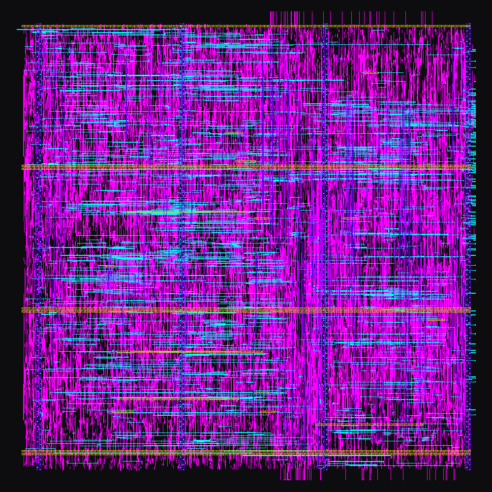
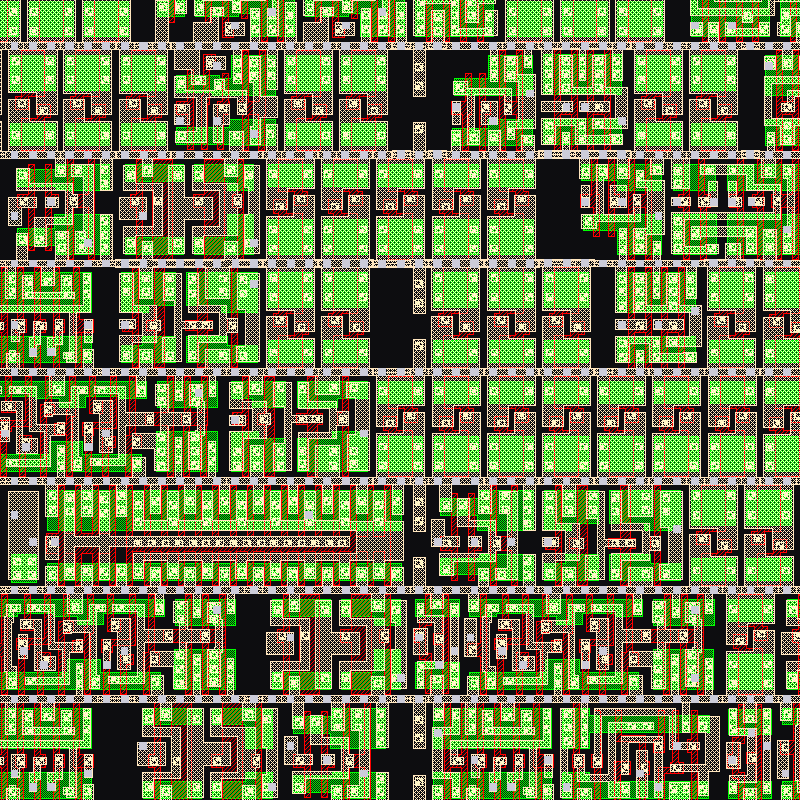

# riscv-5i on Sky130

I wanted to see the core as an actual chip layout and not just FPGA fabric, so I ran it through the open source RTL-to-GDSII flow on the SkyWater 130 nm PDK with [LibreLane](https://github.com/librelane/librelane) 3.0.14. LibreLane wraps Yosys, OpenROAD, Magic, KLayout and Netgen into one flow. The instruction and data memories stay outside the block, same as on the FPGA, so what gets hardened is the pipeline itself: the five stages, forwarding, the hazard unit and the register file.

<p align="center">
  
  <br>
  <em>Routing on met2 through met5 across the whole 0.25 mm^2 block. The long straight stripes are the power grid.</em>
</p>

## Results

The signed-off run uses a 36 ns clock (27.8 MHz) with timing repair aimed at the slow corner.

| Metric | Value |
|---|---|
| Die | 491.9 x 502.6 um (0.247 mm^2) |
| Standard cells | 14505 (1524 flip-flops), 56% utilization |
| Signoff | Magic DRC 0, KLayout DRC 0, LVS clean, antenna 0, XOR 0 |
| Setup slack, slow (`ss_100C_1v60`) | +1.70 ns |
| Setup slack, typical (`tt_025C_1v80`) | +15.70 ns |
| Setup slack, fast (`ff_n40C_1v95`) | +19.23 ns |
| Hold slack | Met at every corner, worst +0.11 ns |
| Power estimate | 4.5 mW |

Slack is the worst of the min, nom and max parasitic extractions at each corner. So the block is DRC and LVS clean and closes timing at every corner at 27.8 MHz. Aimed at the typical corner instead (run 1 below), the same RTL does about 67 MHz at typical but fails the slow corner.

<p align="center">
  
  <br>
  <em>A 20 x 20 um window from the middle of the block: diffusion, poly and local interconnect of the sky130_fd_sc_hd cells. Each row is 2.72 um tall.</em>
</p>

## Timing closure

It took four runs to close the slow corner (ss, 100C, 1.60 V).

| Run | Clock | Repair corner | Slow | Typical | Fast | Result |
|---|---|---|---|---|---|---|
| 1 | 20 ns | typical | -4.67 ns | +5.16 ns | +8.98 ns | Misses slow corner |
| 2 | 26 ns | typical | -5.15 ns | +8.24 ns | +12.74 ns | Misses slow corner |
| 3 | 26 ns | slow | -5.99 ns | +7.91 ns | +12.32 ns | Misses slow corner |
| 4 | 36 ns | slow | +1.70 ns | +15.70 ns | +19.23 ns | Closes |

The metrics JSON for every run is in `results/`. Run 3 also dropped placement density from 50% to 45%.

Run 1 met the typical and fast corners easily and missed the slow one by 4.7 ns. I figured the clock was just too tight, so I loosened it to 26 ns. The slow corner got worse.

That part took me a minute to understand. Loosening the clock doesn't only add slack, it also tells synthesis and repair they can relax. The worst slow-corner path went from about 24.7 ns in run 1 to 31.2 ns in run 2, because the tools stopped upsizing cells once the typical corner had room. On top of that, LibreLane sizes and buffers against `DEFAULT_CORNER`, which is the typical corner unless you change it, so nothing was optimizing for ss at all.

Run 3 set `DEFAULT_CORNER` to `nom_ss_100C_1v60` so repair would work on the slow corner. It came out at -6.0 ns, basically no change: at a 26 ns target, repair couldn't get that path under about 32 ns. Run 4 at 36 ns closes every corner with 1.7 ns to spare at ss.

The worst path starts at the rd field of the EX/MEM register, goes through the forwarding compare and muxes, and then through the ALU. At the slow corner that path takes about 34 ns, roughly 1.7 times what the worst path takes at typical.

## What's not there

This is a hardened block, not a chip. There's no pad ring, no memories and no Tiny Tapeout or Caravel harness around it, and it has 173 I/O pins because the memory buses are ports. Things I'd try next:

- The register file is 1024 flip-flops. Latches or an SRAM macro would shrink the block a lot.
- The ALU adder is whatever Yosys picks by default. `SYNTH_ADDER_TYPE` can swap in a faster one, which goes straight at the slow path.
- Since synthesis follows the clock target, synthesizing against a tight clock and only relaxing the signoff period would probably beat run 4. That's a TODO.
- About 4200 max slew violations are still flagged at the slow corner. They don't break timing at 36 ns, but they're the first thing to clean up.

## Running it

```bash
# One time: a Python venv with LibreLane, and Docker for the tools
uv venv --python 3.12 venv
. venv/bin/activate
uv pip install librelane
python -m librelane --dockerized --smoke-test    # pulls the container and sky130A

# Convert the RTL and run the flow
./convert.sh
python -m librelane --dockerized --pdk-root ~/.ciel config.json
```

A full run takes about 19 minutes on a 32 core machine, and the container plus the PDK is about 10 GB. Everything lands in `runs/<timestamp>/`, with the GDS in `runs/<timestamp>/final/gds/`. `render.py` makes the two images above from that GDS, and `results/PipelinedCPU.gds.gz` is the GDS from run 4.
